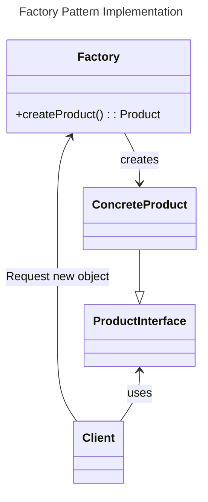
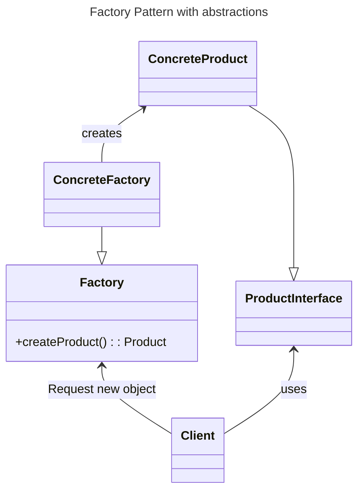

# Factory Pattern

## Motivation

The Factory Design Pattern is probably the most used design pattern in modern programming languages like Java and C#. It comes in different variants and implementations. If you are searching for it, most likely, you'll find references about the *GoF*[^1] patterns: [Factory Method](add url) and [Abstract Factory](TODO add url).

## Intent

-   Creates objects without exposing the instantiation logic to the client.
-   Refers to the newly created object through a common interface

## Implementation



-   The client needs a product, but instead of creating it directly using the `new` operator, it asks the factory object for a new product, providing the information about the type of object it needs.
-   The factory instantiates a new concrete product and then returns to the client the newly created product (casted to abstract product class).
-   The client uses the products as abstract products without being aware about their concrete implementation.

## Applicability & Examples

The factory pattern is one of the most used patterns.

For example a graphical application works with shapes. In our implementation the drawing framework is the client and the shapes are the products. All the shapes are derived from an abstract shape class (or interface). The Shape class defines the draw and move operations which must be implemented by the concrete shapes. Let's assume a command is selected from the menu to create a new Circle. The framework receives the shape type as a string parameter, it asks the factory to create a new shape sending the parameter received from menu. The factory creates a new circle and returns it to the framework, casted to an abstract shape. Then the framework uses the object as casted to the abstract class without being aware of the concrete object type.

The advantage is that new shapes can be added without changing a single line of code in the framework (the client code that uses the shapes from the factory). As it is shown in the next sections, there are certain factory implementations that allow adding new products without even modifying the factory class.

Those are also known as parameterized Factories. The generating method can be written so that it can generate more types of Product objects, using a condition (entered as a method parameter or read from some global configuration parameters - see [Abstract Factory Pattern](TODO: add url) to identify the type of the object that should be created, as below:

```java
public class ProductFactory {
    public Product createProduct(String ProductID) {
        if (id == ID1) {
            return new OneProduct();
		}
        if (id == ID2) {
	        return new AnotherProduct();
		}
		//...and so on, for other IDs

		return null; // if the ID doesn't have an expected value
    }
}
```

This implementation is the most simple and intuitive. The problem here is that once we add a new concrete product we have to modify the Factory class. It is not very flexible and it violates the [open close principle](open_close_principle). Of course we can subclass the factory class, but let's not forget that the factory class is usually used as a [singleton](singleton). Subclassing it means replacing all the factory class references everywhere through the code.

## Class Registration - using reflection

If you can use reflection, for example in Java or .NET languages, you can register new product classes to the factory without even changing the factory itself. For creating objects inside the factory class without knowing the object type we keep a map between the product ID and the class type of the product. In this case when a new product is added to the application it has to be registered to the factory. This operation doesn't require any change in the factory class code.

```java
class ProductFactory {
    private HashMap m_RegisteredProducts = new HashMap();

    public void registerProduct (String productID, Class productClass) {
        m_RegisteredProducts.put(productID, productClass);
    }

    public Product createProduct(String productID) {
        Class productClass = (Class)m_RegisteredProducts.get(productID);
        Constructor productConstructor = 
	        productClass.getDeclaredConstructor(new Class[] { String.class });

        return (Product)productConstructor.newInstance(new Object[] { });
    }
}
```

We can put the registration code anywhere in our code, but a convenient place is inside the product class in a static constructor:

```java
// Registration done outside of product class:
public static void main(String args[]){
    Factory.instance().registerProduct("ID1", OneProduct.class);
}
```

```java
// Registration done inside the product class:
class OneProduct extends Product {
    static {
        Factory.instance().registerProduct("ID1", OneProduct.class);
    }
}
```

We have to make sure that the concrete product classes are loaded before they are required by the factory for registration (if they are not loaded they will not be registered in the factory and `createProduct` will return null). To ensure it we are going to use the `Class.forName` method right in the static section of the main class. This section is executed right after the main class is loaded. `Class.forName` is supposed to return a Class instance of the indicated class. If the class is not loaded by the compiler yet, it will be loaded when the `Class.forName` is invoked. Consequently the static block in each class will be executed when each class is loaded:

```java
class Main {
    static {
        try {
            Class.forName("OneProduct");
            Class.forName("AnotherProduct");
        } catch (ClassNotFoundException any) {
            any.printStackTrace();
        }
    }

    public static void main(String args[]) throws PhoneCallNotRegisteredException {
        // ...
    }
}
```

This reflection implementation has its own drawbacks. The main one is performance. When the reflection is used the performance on code involving reflection can decrease even to 10% of the poerfomance of a non reflection code. Another issue is that not all the programming languages provide reflection mechanism.

### Class Registration - avoiding reflection

As we saw in the previous paragraph the factory object uses internally a HashMap to keep the mapping between parameters (in our case Strings) and concrete products class. The registration is made from outside of the factory and because the objects are created using reflection the factory is not aware of the objects types.

We don't want to use reflection but in the same time we want to have a reduced coupling between the factory and concrete products. Since the factory should be unaware of products we have to move the creation of objects outside of the factory to an object aware of the concrete products classes. That would be the concrete class itself.

We add a new abstract method in the product abstract class. Each concrete class will implement this method to create a new object of the same type as itself. We also have to change the registration method such that we'll register concrete product objects instead of Class objects.

```java
abstract class Product {
    public abstract Product createProduct();
    // ...
}

class OneProduct extends Product {
    // ...
    static {
        ProductFactory.instance().registerProduct("ID1", new OneProduct());
    }

    public OneProduct createProduct() {
        return new OneProduct();
    }
    // ...
}

class ProductFactory {
    public void registerProduct(String productID, Product p) {
        m_RegisteredProducts.put(productID, p);
    }

    public Product createProduct(String productID) {
        ((Product) m_RegisteredProducts.get(productID)).createProduct();
    }
}
```



This implementation represents an alternative for the class registration implementation. Let's assume we need to add a new product to the application. For the procedural switch-case implementation we need to change the Factory class, while in the class registration implementation all we need is to register the class to the factory without actually modifying the factory class. For sure this is a flexible solution.

The procedural implementation is the classical bad example for the [Open-Close Principle](open_close_principle). As we can see there the most intuitive solution to avoid modifying the Factory class is to extend it.

This is the classic implementation of the factory method pattern. There are some drawbacks over the class registration implementation and not so many advantages:

#### Pros
-   The derived factory method can be changed to perform additional operations when the objects are created (maybe some initialization based on some global parameters ...).
#### Cons
-   The factory can not be used as a singleton.
-   Each factory has to be initialized before using it.
-   More difficult to implement.
-   If a new object has to be added a new factory has to be created.

### Conclusion:

When you design an application just think if you really need a factory to create objects. Maybe using it will bring unnecessary complexity in your application. If you have many objects of the same base type and you manipulate them mostly casted to abstract types, then you need a factory.

If you decide to go for a factory, I would recommend using one of class registration implementations (with or without reflection) and to avoid the Factory Method (Factory design pattern with abstractions).

## Footnotes

[^1]: The authors of _**Design Patterns: Elements of Reusable Object-Oriented Software**, Erich Gamma, Richard Helm, Ralph Johnson, and John Vlissides are often referred to as the GoF, or Gang of Four.


